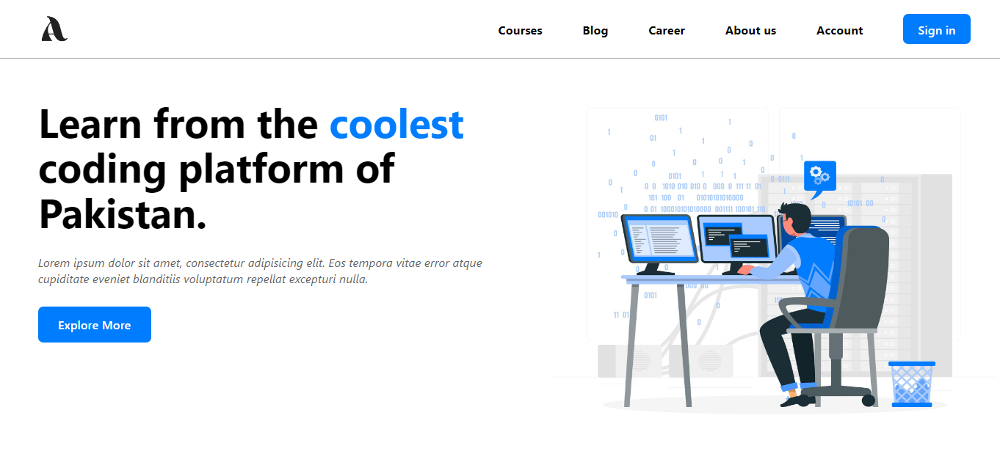

## Mobile Responsive Landing Page - HTML & CSS

This repository contains a project that demonstrates the creation of a mobile-responsive landing page using HTML and CSS. The landing page is designed to adapt to different screen sizes, providing an optimal viewing experience for users accessing the website on mobile devices.

### Preview



### Features

- **Navigation Bar:** The navigation bar offers links to various sections of the landing page and includes a menu icon for small screens.

- **Hero Section:** The hero section presents a headline, subtext, and a call-to-action button, all designed to fit different screen sizes.

- **Responsive Design:** The entire landing page adjusts its layout and content to provide an optimal user experience on mobile devices.

### How to Use

1. Clone the repository using the following command:
   ```sh
   git clone https://github.com/MuhammadAmmarAtique/LandingPage
   ```

2. Open the `index.html` file in your web browser to explore the mobile-responsive landing page.

### Dependencies

The project uses the following external resources:

- Remixicon Icons: Used for icons such as the menu icon in the navigation bar.

### Contributing

This project was created as a demonstration of building a mobile-responsive landing page. Feel free to customize and expand upon the project to enhance your HTML and CSS skills.

### License

This project is intended for educational purposes and is not affiliated with any existing websites. It showcases the use of HTML and CSS for creating mobile-responsive web pages. All resources used are subject to their respective licenses.

Replace placeholder URLs and paths with the actual URLs and paths of the resources you used in your project.
